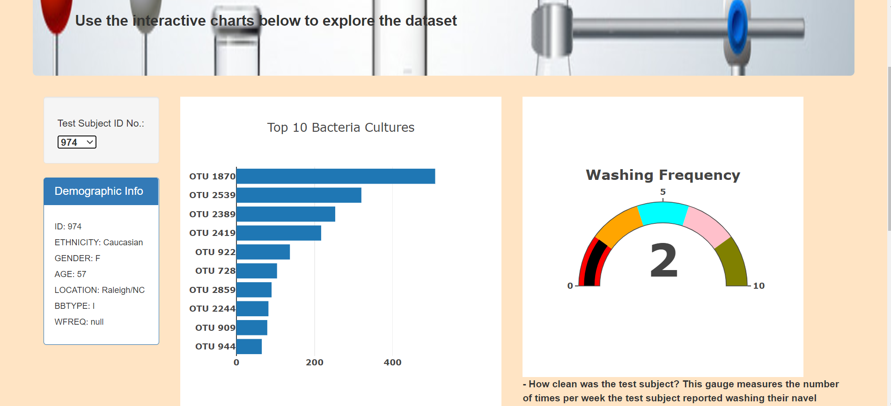

# Bellybutton Biodiversity Analysis
The company Improbable Beef is working on developing a way to manufacture synthetic beef, and is looking into different bacteria that could help them find the taste profile they are looking for. They are looking specifically into bacteria found in the human navel, and want a webpage where their test subjects can identify which bacteria types are most prominent in their own navel. 

- The page allows for users to see multiple measures, including the bacteria types most prevalent in each sample, the amount of times the test subject reported washing their navel, as well as a bubble chart to better visualize the proportion of different bacteria in each subject. 
